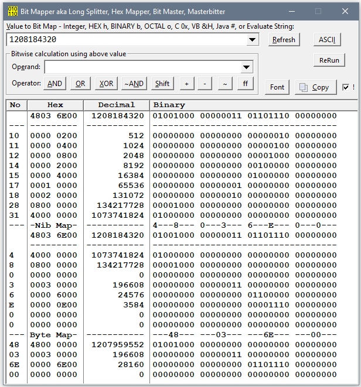
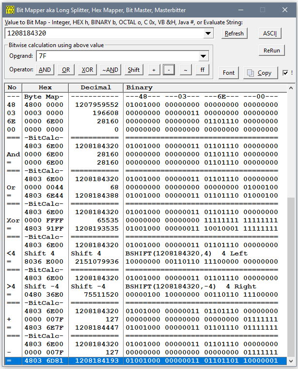

# Bit Mapper

View a LONG Integer split into Bits, Nibbles amd Bytes. Also perform Clarion Bitwise operations on the number e.g. AND, OR, XOR SHIFT.

I made this for working with Windows API where functions can have large Bit Maps that can take time to decode.
 A good example would be GetWindowLong() and SetWindowLong() for GWL_Style and GWL_ExStyle.

Entry of Value and Operand support using C/C++/C# hex format 0x12345678. Also VB6 VB.Net hex format &H12345678.

### Bitwise Operations

You can enter an Operand to use with Operators AND OR XOR SHIFT. There are also Plus (+) and Minus (-) which are often used, but are not bitwise operators, so can have incorrect results.

